# Ray Orchestrator: Page-Slicing Fan-Out Delta

**Branch:** `cau/ray-page-slicing` — changes against `main`
**Implemented in:** `docling-jobkit`; wired in `docling-serve`

This document is a diff companion to `ray-orchestrator-architecture.md`. It shows only what changed: new components, new communication patterns, moved lifecycle ownership, and the new internal type boundary. All sections that are unchanged (dispatcher, Redis key space, reconciliation, tenant fairness) are not repeated here.

Color key used in all diagrams below:

```
  green  = new on this branch
  amber  = existed before, responsibility or contract changed
  gray   = unchanged
```

---

## 1. Component Topology Delta

The single `DocumentProcessorDeployment` is replaced by two cooperating Ray Serve deployments. Everything else in the topology is unchanged.

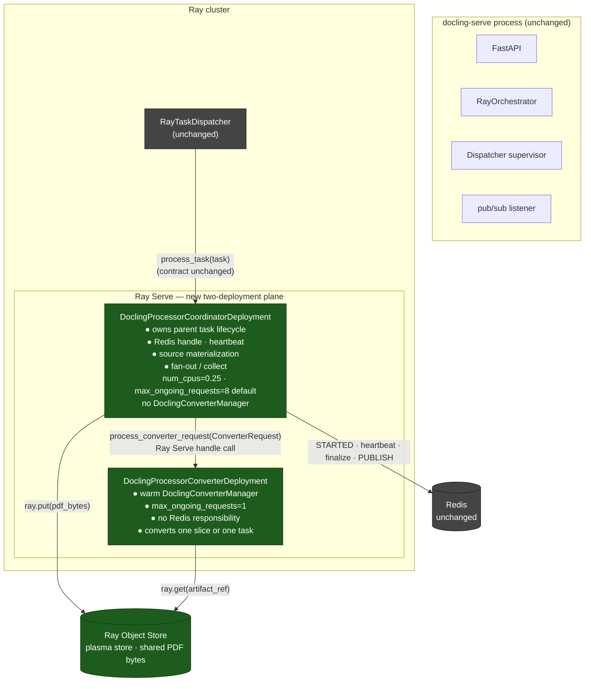

**Key ownership changes:**

| Responsibility | Before (`main`) | After (branch) |
|---|---|---|
| `process_task(task)` entry point | `DocumentProcessorDeployment` | `DoclingProcessorCoordinatorDeployment` ● |
| Redis STARTED + execution lease + heartbeat | `DocumentProcessorDeployment` | `DoclingProcessorCoordinatorDeployment` ● |
| `finalize_task_*_atomic` + PUBLISH | `DocumentProcessorDeployment` | `DoclingProcessorCoordinatorDeployment` ● |
| `DoclingConverterManager` (warm models) | `DocumentProcessorDeployment` | `DoclingProcessorConverterDeployment` ● |
| Source download / decode | `DocumentProcessorDeployment` | Coordinator (PDF fan-out path) ● |
| Per-slice page-range conversion | — did not exist — | `DoclingProcessorConverterDeployment` ● |

The split is explicit: the coordinator and converter are separate deployments with distinct responsibilities.

---

## 2. Communication Patterns

The baseline is a **single serial call** through one Serve deployment. The branch introduces a conditional **fan-out / collect** path inside the coordinator. There are now three distinct execution paths for a task.

### 2a. Passthrough path (unchanged behavior, new coordinator hop)

Applies to: non-PDF formats, multi-source tasks, CHUNK tasks, single-source PDFs with fan-out disabled or below the slice threshold.

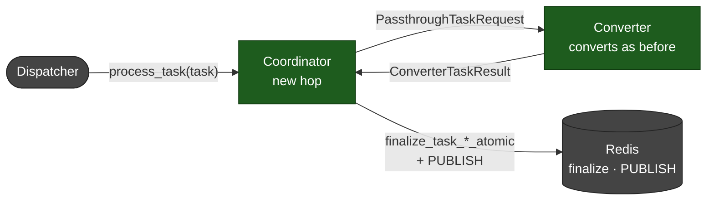

Every task now passes through the coordinator, even when no materialization or fan-out occurs. This adds one Serve handle hop.

### 2b. Materialized PDF, no fan-out (effective pages ≤ `max_page_slice_size`)

Applies when `enable_pdf_page_slice_fanout=true` and the source is a single-source PDF whose effective page range fits in one slice. The source is downloaded/decoded once, placed in the plasma store, and the worker receives an `ObjectRef` instead of re-fetching the bytes.

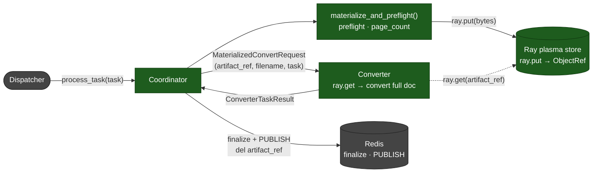

### 2c. Fan-out path (effective pages > `max_page_slice_size`)

Applies when `enable_pdf_page_slice_fanout=true` and the effective page count exceeds `max_page_slice_size`. The coordinator holds the `ObjectRef` for the full parent task duration while N parallel `SliceConvertRequest` calls run on converter replicas. After all slices are collected, the coordinator assembles the final document and finalizes the parent.

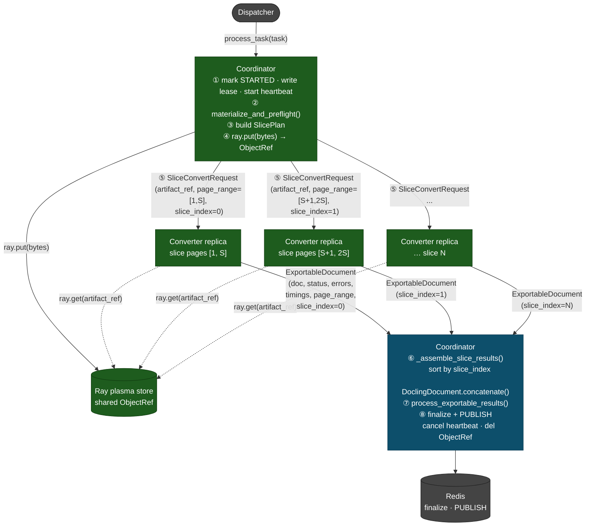

Fan-out concurrency is always **bounded** by `max_page_slice_parallelism` using an `asyncio.wait` sliding-window refill loop. When `max_page_slice_parallelism` is unset, it defaults to `max_concurrent_tasks`.

---

## 3. Task Lifetime on Actors

On `main`, `DocumentProcessorDeployment` owns the full task lifecycle in sequence — STARTED, heartbeat, convert, export, finalize, PUBLISH — while holding its Serve slot (and GPU allocation) for the entire wall-clock duration. See base architecture §3 notes for details.

The branch splits that into two actors:

### Coordinator and converter — lifecycle after the split

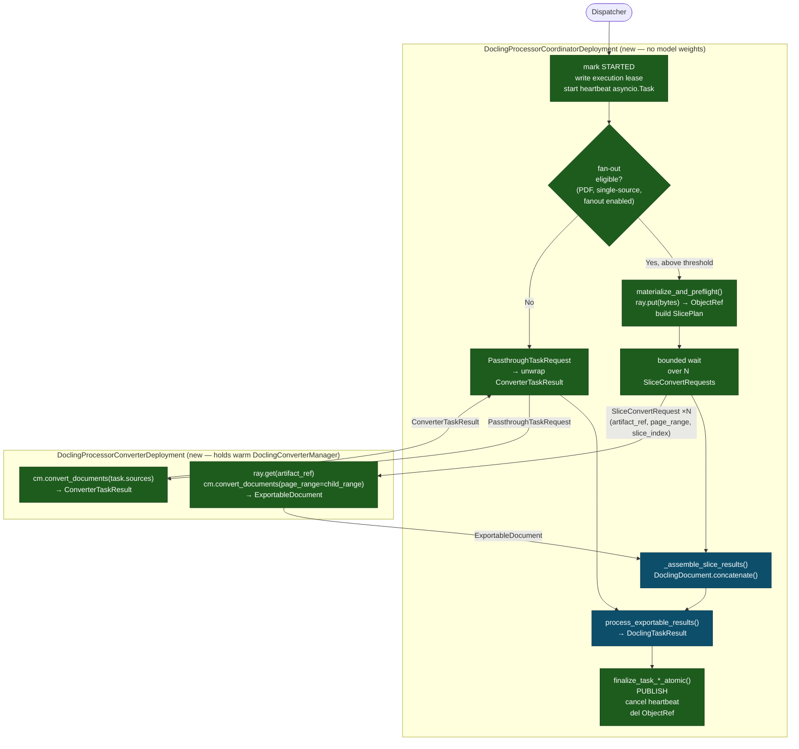

The coordinator holds its Serve slot for the **full parent task duration**, including while child slices are running. Because coordinator replicas carry no GPU or heavy model weights, the idle cost while awaiting child slices is a cheap coordinator slot, not a GPU slot.

---

## 4. Concurrency and Resource Blocking

### 4a. Deadlock protection

A classic Ray Serve deadlock occurs when a deployment replica waits on a call to its **own** deployment: the waiting replica holds its `max_ongoing_requests` slot, and if all slots are full, no new replicas are free to service the call it is waiting on, causing a hang.

The pre-branch single `DocumentProcessorDeployment` with `max_ongoing_requests=1` would deadlock the moment it tried to call itself in parallel. The two-deployment split eliminates this:

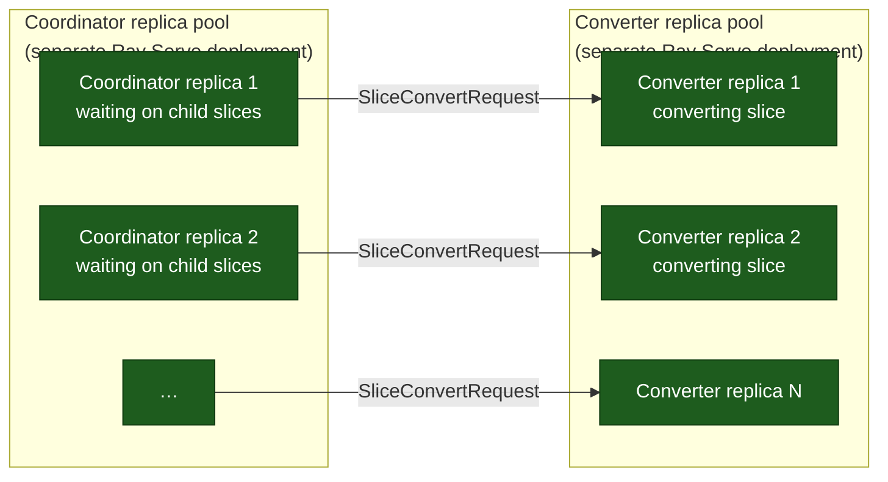

**Why deadlocks cannot occur:**
- Coordinator replicas and converter replicas are in **separate Ray Serve deployment pools**. Ray routes by deployment; a coordinator slot waiting on converters is never occupying a converter slot.
- Multiple coordinators can all be waiting simultaneously — each is async I/O blocked, not holding a thread or a converter slot.
- `max_ongoing_requests=1` on the converter is preserved for thread safety. It limits each converter replica to one slice at a time, but does not interact with coordinator occupancy.
- If all converter replicas are busy, new `SliceConvertRequest` calls queue in Ray Serve's internal backlog for the converter deployment. Coordinators wait async. No slots deadlock.

The only saturation risk is **pool exhaustion**: if `max_page_slice_parallelism` is unset and a very large PDF creates more in-flight slice requests than there are converter replicas, the excess queues in the converter backlog. Coordinators keep waiting; converters keep processing. No deadlock, but latency for other tasks increases until slices drain.

---

### 4b. Resource blocking while a large document is processing

The fan-out path changes which resources are held and for how long compared to the baseline single-document path.

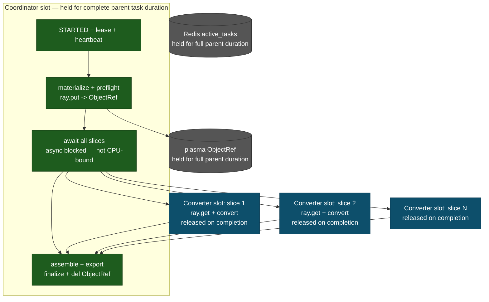

| Resource | Held from | Released | Count per parent | Blocking effect |
|---|---|---|---|---|
| **Coordinator replica slot** | task dispatch | `finalize_task_*_atomic` completes | 1 | 1 slot counts against `coordinator_max_ongoing_requests_per_replica`; coordinator carries no GPU/model weight, so slot cost is cheap |
| **Ray plasma ObjectRef** | `ray.put()` after preflight | `del artifact_ref` in coordinator `finally` | 1 | Plasma memory held for full parent lifetime; released even on failure or coordinator crash |
| **Redis `active_tasks`** | dispatcher admission | `finalize_task_*_atomic` | 1 (the parent) | Counts against tenant `max_concurrent_tasks`; child slices do **not** increment this counter |
| **Converter replica slot** | slice dispatch | slice `ExportableDocument` returned | Up to `max_page_slice_parallelism` (or all slices if unset) | Each converter slot is at `max_ongoing_requests=1`; held only for the duration of one slice, then released |
| **Execution heartbeat** | lease write | coordinator `finally` cancels asyncio task | 1 per parent | Async loop; negligible cost beyond Redis traffic |

**Key change from baseline** (see base architecture §3 notes for the baseline): on this branch the GPU-capable converter slot is held only for the duration of one slice, not the full parent conversion. The coordinator slot is held for the full duration but is cheap — 0.25 CPU by default in `docling-serve`, no model weights. Converter replicas that finish a slice are immediately available for slices from other parents.

---

## 5. Data Type Boundaries  

### New internal types introduced on the branch

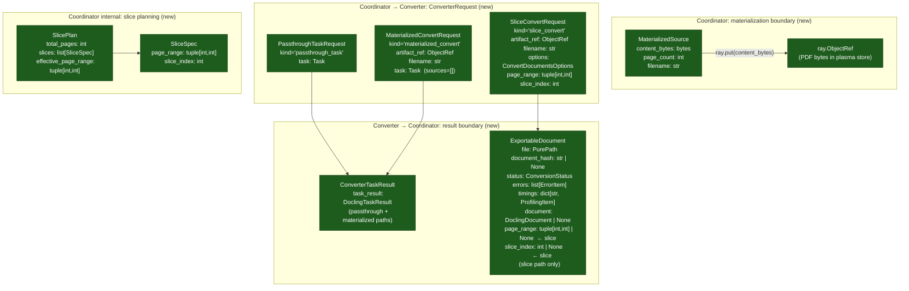

### ExportableDocument replaces ConversionResult across the export pipeline

This is the most pervasive type change. On `main`, `process_export_results()` accepted `Iterable[ConversionResult]` — a docling-internal type that bundles the converter's lazy `InputDocument` reference with the output. On the branch, the primary entry point is `process_exportable_results(exportable_documents: Iterable[ExportableDocument])`.

`ExportableDocument` is a plain Pydantic model — no `InputDocument` reference, no raw file handles — carrying only what the export pipeline needs: filename, hash, status, errors, timings, and an optional `DoclingDocument`. The old `process_export_results(conv_results)` is kept as a deprecated shim for non-Ray orchestrators.

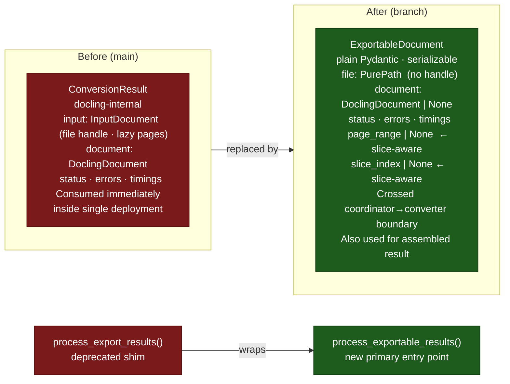

**Why this matters for fan-out:** `ConversionResult` is tied to a single converter run and carries a live `InputDocument`. `ExportableDocument` is a data-only snapshot that can represent a reassembled slice (produced by `_assemble_slice_results`) and fed into the same export helpers without any knowledge of slicing at the export layer.

### Naming delta: plan vs. implementation

The plan used "chunk" terminology throughout. The implementation uses "slice".

| Plan name | Implemented name |
|---|---|
| `ChunkResult` | `ExportableDocument` (unified with the export pipeline type) |
| `ChunkSpec` | `SliceSpec` |
| `SplitPlan` | `SlicePlan` |
| `chunk_convert` request variant | `SliceConvertRequest` |
| `enable_pdf_page_chunk_fanout` | `enable_pdf_page_slice_fanout` |
| `max_page_chunk_size` | `max_page_slice_size` |
| `max_page_chunk_parallelism` | `max_page_slice_parallelism` |

`ChunkResult` was also **merged into** `ExportableDocument` rather than kept as a separate type — the same model is used as the per-slice worker return value (with `page_range` and `slice_index` set) and as the assembled result fed into the export pipeline (those fields `None`).

---

## 6. Deployment Configuration Delta

### New config knobs (`RayOrchestratorConfig`)

```python
enable_pdf_page_slice_fanout: bool = False        # master gate
max_page_slice_size: int = 10                     # pages per child slice
max_page_slice_parallelism: Optional[int] = None  # concurrent in-flight slices cap

# Coordinator-specific resource overrides (normalized at startup if None)
coordinator_target_requests_per_replica: Optional[int] = None
coordinator_max_ongoing_requests_per_replica: Optional[int] = None
coordinator_actor_num_cpus: float = 0.25
coordinator_actor_memory_request: Optional[str] = None
converter_actor_memory_request: Optional[str] = None
```

Existing autoscaling knobs (`min_actors`, `max_actors`, `upscale_delay_s`, `downscale_delay_s`, `graceful_shutdown_*`) are **shared** between coordinator and converter — both deployments use the same scaling bounds.

`RayOrchestratorConfig` normalizes `max_page_slice_parallelism` to `max_concurrent_tasks` when unset, and if `coordinator_actor_memory_request` is unset it inherits `converter_actor_memory_request`.

### `docling-serve` runtime defaults and guards

`docling-serve` wires the feature with service-level defaults that differ from the bare `RayOrchestratorConfig` defaults:

```python
eng_ray_max_page_slice_size: int = 32
eng_ray_coordinator_max_ongoing_requests_per_replica: int = 8
eng_ray_coordinator_actor_num_cpus: float = 0.25
```

At startup, `docling_serve.app` also verifies that the installed `docling-jobkit` build contains `docling_jobkit.convert.materialization`; if not, Ray mode raises an actionable compatibility error before the app starts serving requests.

### Deployment wiring (`create_deployment`)

Before: `deploy_processor()` produced a single `DocumentProcessorDeployment` handle.

After: `create_deployment()` produces a coordinator–converter pair wired via Ray Serve's `.bind()` DAG, with the converter handle injected into the coordinator constructor. The dispatcher still calls `process_task(task)` on the same handle — the deployment split is invisible to the dispatcher.

---

## 7. Failure Mode Additions

The existing failure modes (replica OOM, dispatcher death, Redis unavailable) are unchanged. Two new coordinator-specific behaviors:

### Fan-out setup failure (catches before any child launches)

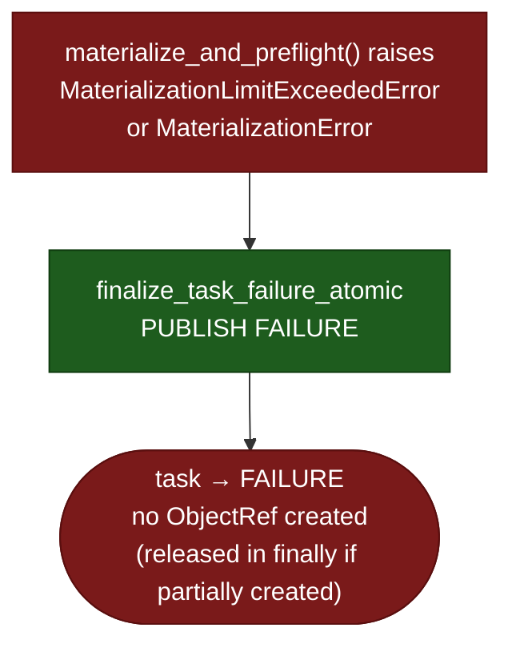

`MaterializationLimitExceededError` is a structured subclass of `MaterializationError`. Both map to task FAILURE before any `SliceConvertRequest` is sent.

### Partial child failure (some slices fail, some succeed)

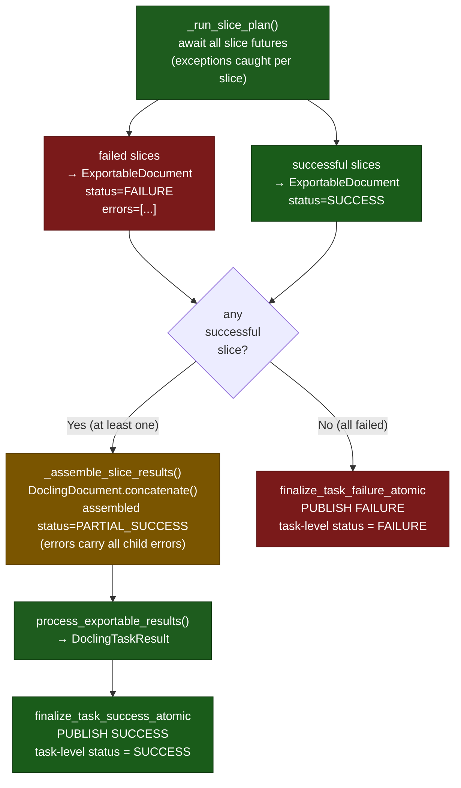

Task-level `TaskStatus` remains binary (`SUCCESS` / `FAILURE`). Partial page coverage is expressed in the result document's `ConversionStatus.PARTIAL_SUCCESS`, not in `TaskStatus`.

---

## Source Pointers (branch additions)

| Component | File |
|---|---|
| Coordinator deployment | `docling_jobkit/orchestrators/ray/serve_deployment.py` — `DoclingProcessorCoordinatorDeployment` |
| Converter deployment | `docling_jobkit/orchestrators/ray/serve_deployment.py` — `DoclingProcessorConverterDeployment` |
| Source materialization + preflight | `docling_jobkit/convert/materialization.py` |
| Slice / converter request models | `docling_jobkit/orchestrators/ray/models.py` — `SliceSpec`, `SlicePlan`, `ConverterRequest`, … |
| Exportable document type | `docling_jobkit/datamodel/exportable_document.py` |
| New export pipeline entry point | `docling_jobkit/convert/results.py` — `process_exportable_results()` |
| Fan-out config knobs | `docling_jobkit/orchestrators/ray/config.py` |
| Settings wire-up | `docling_serve/settings.py`, `docling_serve/orchestrator_factory.py` |
