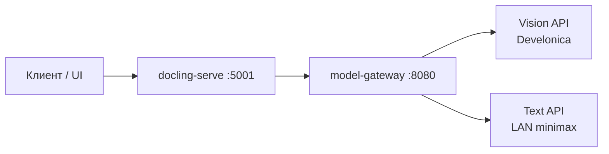

# Документация doclingllm

$START_DOC_NAME

**PURPOSE:** Единая точка входа в документацию **для людей** — назначение проекта, стек, деплой, индекс гайдов и связь с картой агента Grace 2.
**SCOPE:** Обзор продукта, эксплуатация, ссылки на контракты и планы; без дублирования полного AppGraph.
**KEYWORDS:** doclingllm, docling-serve, Model Gateway, Docker, Grace 2, Develonica, minimax, documentation hub

> **Карта агента (Grace 2):** [`plans/`](../plans/) — `DevelopmentPlan.md`, `Architecture.md`, `AppGraph.xml`, `business_requirements.md`.  
> **Журнал итераций:** [`HISTORY.md`](HISTORY.md).

$START_DOCUMENT_PLAN
### Document Plan

**SECTION_GOALS:**
- GOAL Объяснить назначение и архитектуру на высоком уровне => G_OVERVIEW
- GOAL Описать стек и структуру репозитория => G_STACK
- GOAL Дать индекс всех документов проекта => G_INDEX

**SECTION_USE_CASES:**
- USE_CASE Operator читает docs перед деплоем => UC_OPERATOR
- USE_CASE Agent сверяет human docs с plans/ => UC_AGENT_SYNC

$END_DOCUMENT_PLAN

---

$START_SECTION_OVERVIEW
## Обзор проекта

$START_ARTIFACT_SUMMARY
#### Назначение

**TYPE:** GOAL
**KEYWORDS:** remote inference, wrapper

$START_CONTRACT
**PURPOSE:** Конвертация PDF и других документов через docling-serve без локальных ML-весов в runtime.
**DESCRIPTION:** doclingllm — deployment wrapper: официальный образ `docling-serve-cpu` + наш **Model Gateway**, который реализует KServe v2 и OpenAI proxy для внешних API. Vendor `docling-serve/**` не изменяется; overlay — `deploy/docling-serve/` (логи, VLM preset inject).
**RATIONALE:** OCR/layout/VLM в docling не используют один OpenAI endpoint; gateway адаптирует протоколы.
**ACCEPTANCE_CRITERIA:** `DOCLING_SERVE_LOAD_MODELS_AT_BOOT=false`; presets в YAML → `http://model-gateway:8080`.
$END_CONTRACT

$START_BODY



**Рекомендация UI:** для сканов и форм — pipeline **Standard**; **Vlm** — для VLM-heavy сценариев (preset inject в overlay 0.2.22+).

$END_BODY

$END_ARTIFACT_SUMMARY
$END_SECTION_OVERVIEW

---

$START_SECTION_STACK
## Стек и конфигурация

$START_ARTIFACT_STACK
#### Technology stack

**TYPE:** DECISION
**KEYWORDS:** Python, FastAPI, Docker

$START_BODY

| Слой | Технология |
|------|------------|
| Gateway | Python 3.11+, FastAPI, httpx, numpy |
| docling-serve | Official CPU image + overlay Dockerfile |
| Оркестрация | Docker Compose v2 |
| Конфиг | `deploy/.env`, `deploy/config/*.yaml` |
| Тесты | pytest (`pip install -e ".[dev]"`) |
| Версия | [`VERSION`](../VERSION) SemVer |

**Backend'ы (env):**

| Backend | Переменные | Назначение |
|---------|------------|------------|
| vision | `VISION_API_BASE_URL`, `VISION_MODEL`, `VISION_API_KEY` | OCR, layout, picture_*, VLM |
| text | `TEXT_API_BASE_URL`, `TEXT_MODEL` | code/formula enrichment |

Дефолты: [`deploy/.env.defaults`](../deploy/.env.defaults).

$END_BODY

$END_ARTIFACT_STACK
$END_SECTION_STACK

---

$START_SECTION_STRUCTURE
## Структура репозитория

$START_BODY

| Путь | Назначение |
|------|------------|
| `src/doclingllm/gateway/` | Model Gateway: KServe, OpenAI proxy, parsers, routing |
| `deploy/config/` | `docling-serve.yaml`, `gateway-models.yaml` |
| `deploy/docling-serve/` | Overlay образа: logging, VLM preset middleware |
| `deploy/gateway/` | Dockerfile gateway |
| `scripts/` | `start.sh`, `stop.sh`, `redeploy.sh`, `healthcheck.sh` |
| `plans/` | Grace 2: план, архитектура, граф, требования |
| `tests/` | Unit/integration; [`test_guide.md`](../tests/test_guide.md) |
| `work/` | Черновики агента (**не в git**) |
| `.cursor/`, `.kilocode/` | Rules и skills Grace 2 (**локально**) |

$END_BODY

$END_SECTION_STRUCTURE

---

$START_SECTION_DEPLOY
## Эксплуатация

$START_ARTIFACT_OPS
#### Operator commands

**TYPE:** USE_CASE
**KEYWORDS:** start.sh, redeploy, health

$START_BODY

```bash
./scripts/start.sh        # compose up --build; первый раз — VISION_API_KEY
./scripts/healthcheck.sh  # gateway + docling-serve
./scripts/stop.sh
./scripts/redeploy.sh     # git pull + rebuild (после обновления overlay)
```

После rebuild docling-serve в логе build: `VLM preset patches verified in image`.

UI: http://localhost:5001/ui  
API: http://localhost:5001/v1/convert/file

$END_BODY

$END_ARTIFACT_OPS
$END_SECTION_DEPLOY

---

$START_SECTION_INDEX
## Индекс документов

$START_BODY

### Для людей (`docs/`)

| Файл | Содержание |
|------|------------|
| [`gateway_api_contract.md`](gateway_api_contract.md) | Endpoints gateway, KServe tensors, parsers, TRACE logs |
| [`subagent_setup_guide.md`](subagent_setup_guide.md) | grok_searcher / Kilo CLI |
| [`environment_fix_guide.md`](environment_fix_guide.md) | venv vs global Python в IDE |
| [`HISTORY.md`](HISTORY.md) | Журнал решений по итерациям |

### Для агентов (`plans/`)

| Файл | Протокол |
|------|----------|
| [`DevelopmentPlan.md`](../plans/DevelopmentPlan.md) | devplan-protocol |
| [`Architecture.md`](../plans/Architecture.md) | document-protocol |
| [`business_requirements.md`](../plans/business_requirements.md) | document-protocol |
| [`AppGraph.xml`](../plans/AppGraph.xml) | graph-protocol |
| [`README.md`](../plans/README.md) | Навигация по plans/ |

### README по каталогам

| Файл | Содержание |
|------|------------|
| [`../README.md`](../README.md) | Корень: quick start, Grace workflow |
| [`../src/README.md`](../src/README.md) | Исходники gateway |
| [`../tests/README.md`](../tests/README.md) | pytest layout |
| [`../work/README.md`](../work/README.md) | Вспомогательные артефакты |
| [`../tests/test_guide.md`](../tests/test_guide.md) | mode-qa checklist |

### Vendor (read-only)

| Файл | Примечание |
|------|------------|
| [`../docling-serve/README.md`](../docling-serve/README.md) | Upstream docling-serve |
| [`../docling-serve/docs/`](../docling-serve/docs/) | Upstream docs — **не редактировать** |

$END_BODY

$END_SECTION_INDEX

---

$START_SECTION_RULES
## Правила агента

$START_BODY

| Источник | Назначение |
|----------|------------|
| `.cursor/rules/grace-2-framework.mdc` | Семантическая разметка, фазы mode-* |
| `.cursor/rules/agent-rules.mdc` | Ops: HISTORY, git, `work/`, навигация |
| `.cursor/rules/doclingllm.mdc` | Commit/push после задачи, VERSION |

Фазы: **Architect** → **Code** → **Debug** → **QA** (skill обязателен для каждой фазы).

$END_BODY

$END_SECTION_RULES

$END_DOC_NAME
