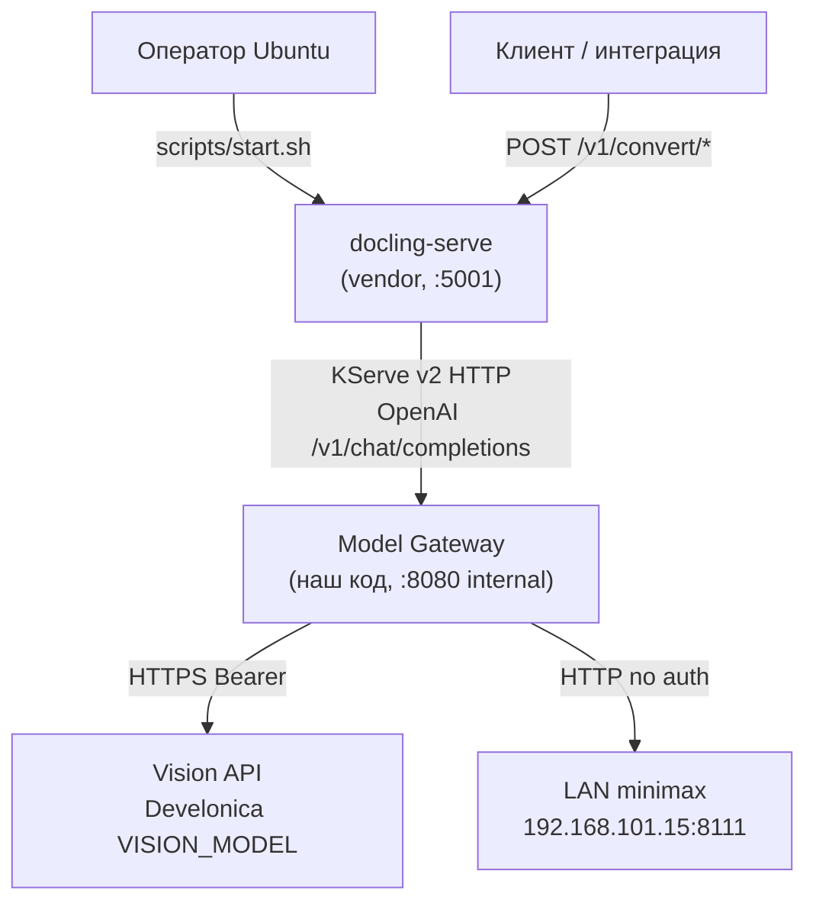
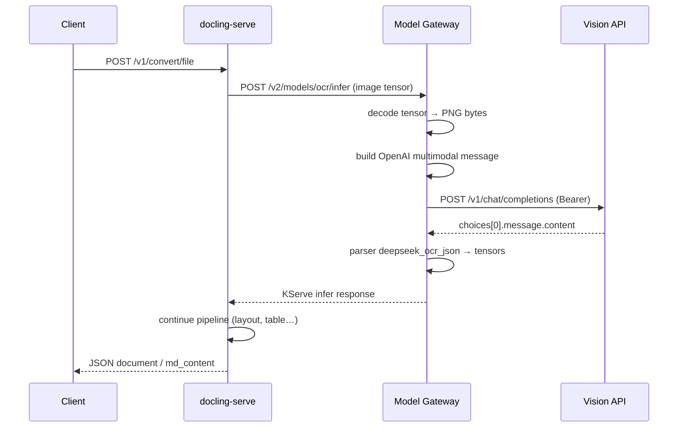
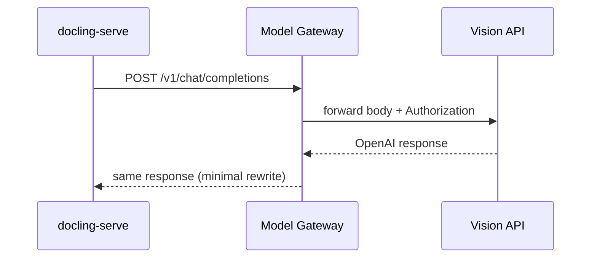
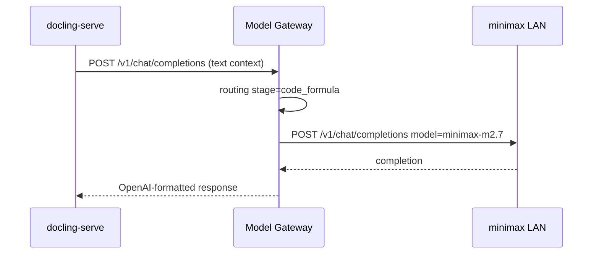
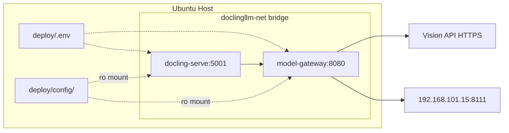

# Архитектура решения: doclingllm

$START_DOC_NAME

**PURPOSE:** Детальная архитектура обёртки docling-serve с Model Gateway для маршрутизации всех ML-стадий во внешние API (vision Develonica + LAN minimax) без изменения vendor-кода.
**SCOPE:** Компоненты, слои, интерфейсы, деплой, делегирование mode-code.
**KEYWORDS:** docling-serve, Model Gateway, KServe v2, OpenAI-compatible, Docker, adapter, parser, Develonica, VISION_MODEL, minimax

**Ссылки:** `plans/DevelopmentPlan.md` v0.1.1, `plans/business_requirements.md`, `plans/AppGraph.xml`

$START_DOCUMENT_PLAN
### Document Plan

**SECTION_GOALS:**
- GOAL Зафиксировать границы системы и внешние зависимости => G_BOUNDARIES
- GOAL Описать слои Model Gateway и контракты => G_LAYERS
- GOAL Спроектировать деплой Ubuntu/Docker => G_DEPLOY
- GOAL Сформировать feature slices для mode-code => G_DELEGATE

**SECTION_USE_CASES:**
- USE_CASE Operator → start.sh → healthy stack => UC_DEPLOY
- USE_CASE Client → docling-serve → gateway → vision API / LAN => UC_CONVERT
- USE_CASE pytest → gateway functions directly => UC_TEST

$END_DOCUMENT_PLAN

---

$START_SECTION_CONTEXT
## 1. Контекст системы (C4 Level 1)

$START_ARTIFACT_SYSTEM_CONTEXT
#### System Context

**TYPE:** DECISION
**KEYWORDS:** C4, boundaries, external systems

$START_CONTRACT
**PURPOSE:** Определить акторов и внешние системы.
**DESCRIPTION:** doclingllm — deployment wrapper. Единственная точка входа для клиентов — HTTP API docling-serve (:5001). ML-инференс полностью вынесен наружу через Model Gateway.
**RATIONALE:** Сохранить совместимость с upstream docling-serve API; изолировать адаптацию внешних API в нашем коде.
**ACCEPTANCE_CRITERIA:** Диаграмма контекста покрывает все внешние вызовы; vendor не модифицируется.
$END_CONTRACT

$START_BODY



| Актор / система | Роль |
|-----------------|------|
| **Клиент** | Загружает документы, получает Markdown/JSON |
| **Оператор** | Деплой, `.env`, мониторинг |
| **docling-serve** | Оркестрация пайплайна Docling (read-only vendor) |
| **Model Gateway** | Протокольный адаптер KServe ↔ OpenAI |
| **Vision API (Develonica)** | OCR/layout/VLM (`VISION_MODEL`, default `qwen3.6-35b-a3b`) |
| **LAN minimax** | Текст (`minimax-m2.7`) |

$END_BODY

$END_ARTIFACT_SYSTEM_CONTEXT
$END_SECTION_CONTEXT

---

$START_SECTION_LAYERS
## 2. Архитектурные слои

$START_ARTIFACT_LAYER_MODEL
#### Layer Model (Gateway)

**TYPE:** PRINCIPLE
**KEYWORDS:** layered architecture, separation of concerns

$START_CONTRACT
**PURPOSE:** Изолировать протоколы, бизнес-адаптацию и транспорт для maintainability агентами.
**DESCRIPTION:** Gateway построен по Pattern 1 (Backend isolation). Нет UI-слоя. Тесты импортируют функции слоёв 2–4 напрямую.
**RATIONALE:** mode-architect Golden Standard — strict layer isolation + plugin entry points.
**ACCEPTANCE_CRITERIA:** Каждый модуль `src/doclingllm/gateway/*.py` относится ровно к одному слою.
$END_CONTRACT

$START_BODY

```text
┌─────────────────────────────────────────────────────────────┐
│ L1 Transport    │ app.py          │ FastAPI routes, health    │
├─────────────────┼─────────────────┼───────────────────────────┤
│ L2 Protocol     │ kserve.py       │ KServe v2 decode/encode   │
│                 │ openai_proxy.py │ OpenAI pass-through       │
├─────────────────┼─────────────────┼───────────────────────────┤
│ L3 Adaptation   │ routing.py      │ stage → endpoint/mode     │
│                 │ parsers/*.py    │ LLM text → tensor layout  │
├─────────────────┼─────────────────┼───────────────────────────┤
│ L4 Integration  │ client.py       │ httpx → vision API / LAN  │
│                 │ config.py       │ env + YAML load           │
└─────────────────┴─────────────────┴───────────────────────────┘
         ▲                              ▲
         │ deploy/config/               │ deploy/.env
         │ gateway-models.yaml          │ (secrets)
         │ docling-serve.yaml           │
```

| Слой | Модуль | Ответственность | Запрещено |
|------|--------|-----------------|-----------|
| L1 | `app.py` | HTTP routing, middleware, lifespan | HTTP-вызовы наружу |
| L2 | `kserve.py`, `openai_proxy.py` | Parse/build протокольных сообщений | Парсинг LLM-ответов |
| L3 | `routing.py`, `parsers/` | Stage routing, prompt templates, tensor mapping | Raw httpx |
| L4 | `client.py`, `config.py` | Outbound HTTP, retries, auth | Knowledge of KServe |

**Entry point для тестов и runtime:** `create_app()` → ASGI; для unit-тестов — прямые вызовы `handle_infer()`, `infer_stage()`, `parse_*()`.

$END_BODY

$END_ARTIFACT_LAYER_MODEL
$END_SECTION_LAYERS

---

$START_SECTION_COMPONENTS
## 3. Компоненты и интерфейсы

$START_ARTIFACT_GATEWAY_API
#### Model Gateway — публичный API (внутренний для docling-serve)

**TYPE:** DATA_FORMAT
**KEYWORDS:** KServe v2, OpenAI, REST

$START_CONTRACT
**PURPOSE:** Контракт между docling-serve и gateway.
**DESCRIPTION:** docling-serve обращается только к этим URL внутри docker network `doclingllm-net`.
**ACCEPTANCE_CRITERIA:** Все presets в `docling-serve.yaml` ссылаются только на эти endpoints.
$END_CONTRACT

$START_BODY

| Method | Path | Потребитель docling | Backend |
|--------|------|---------------------|---------|
| GET | `/health` | start.sh, compose healthcheck | local |
| POST | `/v2/models/ocr/infer` | OCR preset (kserve_v2_ocr) | vision backend |
| POST | `/v2/models/layout/infer` | Layout preset | vision backend |
| POST | `/v2/models/table/infer` | Table preset | vision backend |
| POST | `/v2/models/picture_classifier/infer` | Picture classification | vision backend |
| POST | `/v1/chat/completions` | VLM / picture_description presets | vision proxy |

**KServe request (упрощённо):** JSON с `inputs[]` — tensor `image` (bytes/base64), optional `lang`, `scale`.  
**KServe response:** `outputs[]` — tensors в layout, ожидаемом docling для данной стадии (см. `docs/gateway_api_contract.md` — Phase P8).

**OpenAI proxy:** тело запроса pass-through + подстановка `model` из preset; добавление `Authorization` для vision backend.

$END_BODY

$END_ARTIFACT_GATEWAY_API

$START_ARTIFACT_DOCLING_CONFIG
#### docling-serve — конфигурационный контракт

**TYPE:** DECISION
**KEYWORDS:** YAML presets, enable_remote_services

$START_CONTRACT
**PURPOSE:** Направить все стадии на gateway без правок Python vendor.
**DESCRIPTION:** Файл `deploy/config/docling-serve.yaml` монтируется read-only; env из compose имеет приоритет над YAML для секретов.
**ACCEPTANCE_CRITERIA:** `load_models_at_boot: false`, все `custom_*_presets` → `http://model-gateway:8080`.
$END_CONTRACT

$START_BODY

**Обязательные env (compose):**

```yaml
DOCLING_SERVE_CONFIG_FILE: /config/docling-serve.yaml
DOCLING_SERVE_ENABLE_REMOTE_SERVICES: "true"
DOCLING_SERVE_LOAD_MODELS_AT_BOOT: "false"
DOCLING_DEVICE: cpu
DOCLING_SERVE_LOG_FORMAT: json
```

**Preset matrix:**

| Стадия docling | preset id | kind / engine | gateway target |
|----------------|-----------|---------------|----------------|
| OCR | `remote_ocr` | `kserve_v2_ocr` | `/v2/models/ocr/infer` |
| Layout | `remote_layout` | kserve layout OD | `/v2/models/layout/infer` |
| Table | `remote_table` | kserve table | `/v2/models/table/infer` |
| Picture class | `remote_pic_class` | kserve | `/v2/models/picture_classifier/infer` |
| VLM | `remote_vlm` | engine `api` | `/v1/chat/completions` |
| Picture desc | `remote_pic_desc` | engine `api` | `/v1/chat/completions` |
| Code/formula | `remote_code_formula` | engine `api` | `/v1/chat/completions` → routing to text |

> Code-агент: сверить exact `kind` strings с `docling>=2.113` pipeline_options перед финализацией YAML.

$END_BODY

$END_ARTIFACT_DOCLING_CONFIG

$START_ARTIFACT_ROUTING
#### Маршрутизация стадий (gateway-models.yaml)

**TYPE:** TOOL
**KEYWORDS:** routing, vision, text, parsers

$START_CONTRACT
**PURPOSE:** Декларативная карта stage → external API.
**DESCRIPTION:** `routing.py` загружает YAML при старте; env-подстановка `${VISION_API_BASE_URL}` и т.д.
**ACCEPTANCE_CRITERIA:** Изменение маршрута — только YAML + env, без правок Python (кроме нового parser plugin).
$END_CONTRACT

$START_BODY

| stage | endpoint | mode | model | parser |
|-------|----------|------|-------|--------|
| ocr | vision | openai_vision | `${VISION_MODEL}` | `deepseek_ocr_json` |
| layout | vision | openai_vision | `${VISION_MODEL}` | `layout_boxes_json` |
| table | vision | openai_vision | `${VISION_MODEL}` | `table_structure_json` |
| picture_classification | vision | openai_vision | `${VISION_MODEL}` | `classification_json` |
| picture_description | vision | openai_vision | `${VISION_MODEL}` | `plain_text` |
| vlm | vision | openai_proxy | `${VISION_MODEL}` | pass-through |
| code_formula | text | openai_text | minimax-m2.7 | `plain_text` |

**Parser registry (`parsers/__init__.py`):** dict `PARSER_REGISTRY[name] -> Callable[[str], dict]`.

$END_BODY

$END_ARTIFACT_ROUTING

$END_SECTION_COMPONENTS

---

$START_SECTION_SEQUENCES
## 4. Потоки данных (sequence)

$START_ARTIFACT_SEQ_OCR
#### Sequence: OCR stage

**TYPE:** USE_CASE
**KEYWORDS:** OCR, KServe, vision API

$START_BODY



$END_BODY

$END_ARTIFACT_SEQ_OCR

$START_ARTIFACT_SEQ_VLM
#### Sequence: VLM pass-through

$START_BODY



$END_BODY

$END_ARTIFACT_SEQ_VLM

$START_ARTIFACT_SEQ_TEXT
#### Sequence: code/formula (minimax)

$START_BODY



$END_BODY

$END_ARTIFACT_SEQ_TEXT

$END_SECTION_SEQUENCES

---

$START_SECTION_DEPLOY
## 5. Деплой (Ubuntu + Docker)

$START_ARTIFACT_TOPOLOGY
#### Deployment Topology

**TYPE:** NFR
**KEYWORDS:** docker compose, network, CPU

$START_CONTRACT
**PURPOSE:** Production-ready stack на Ubuntu CPU-only.
**DESCRIPTION:** Два контейнера в bridge network; docling-serve публикует :5001; gateway только internal.
**ACCEPTANCE_CRITERIA:** `scripts/start.sh` идempotent; healthchecks green.
$END_CONTRACT

$START_BODY



**docker-compose.yml (логика):**

| Service | Image | Ports | Healthcheck |
|---------|-------|-------|-------------|
| model-gateway | build `deploy/gateway/Dockerfile` | expose 8080 | `GET /health` |
| docling-serve | `quay.io/docling-project/docling-serve-cpu` (pin tag) | `5001:5001` | upstream `/health` |

**Сеть LAN (решение по умолчанию):** bridge + прямой IP `192.168.101.15` (работает если Ubuntu-маршрутизатор видит LAN). Fallback: `network_mode: host` для gateway — documented in `scripts/start.sh` comment.

**Pin образа:** `docling-serve-cpu:<version>` — не `latest` (риск breaking presets).

**Volumes:**

```yaml
volumes:
  - ./config:/config:ro
env_file:
  - ../.env   # относительно deploy/
```

$END_BODY

$END_ARTIFACT_TOPOLOGY

$START_ARTIFACT_SCRIPTS
#### Operational Scripts

$START_BODY

| Script | Действие |
|--------|----------|
| `scripts/start.sh` | check docker → load `.env` → `compose up -d --build` → wait health → print URLs |
| `scripts/stop.sh` | `compose down` |
| `scripts/healthcheck.sh` | curl gateway + docling-serve; exit 0/1 |

$END_BODY

$END_ARTIFACT_SCRIPTS

$END_SECTION_DEPLOY

---

$START_SECTION_SECURITY
## 6. Безопасность и observability

$START_ARTIFACT_SECURITY
#### Security Boundaries

**TYPE:** NFR
**KEYWORDS:** secrets, TLS, logging

$START_BODY

| Объект | Правило |
|--------|---------|
| `VISION_API_KEY` | Только `deploy/.env`, gitignore |
| Логи gateway | Не логировать Bearer token; mask `Authorization` |
| docling-serve | `DOCLING_SERVE_API_KEY` optional для клиентского API |
| Vision API | HTTPS verify default true |
| LAN minimax | HTTP plain — acceptable в private LAN |

**Observability:** JSON logs (`DOCLING_SERVE_LOG_FORMAT=json`); gateway structured logging `[IMP:*]`; correlation via docling `X-Docling-Log-*` headers pass-through.

$END_BODY

$END_ARTIFACT_SECURITY

$END_SECTION_SECURITY

---

$START_SECTION_TECH
## 7. Technology Stack

$START_ARTIFACT_STACK
#### Stack Decisions

**TYPE:** DECISION
**KEYWORDS:** Python, FastAPI, httpx

$START_BODY

| Компонент | Технология | Обоснование |
|-----------|------------|-------------|
| Gateway runtime | Python 3.12 | Align with docling-serve Containerfile |
| HTTP server | FastAPI + uvicorn | Async, OpenAPI for debug, ASGI standard |
| Outbound HTTP | httpx | Async, timeouts, compatible with pytest mock |
| Config | pydantic-settings + PyYAML | Env > YAML; typed validation |
| Tensor ops | numpy | KServe payload encode/decode |
| docling-serve | Official CPU image | Vendor unchanged |
| Orchestration | Docker Compose v2 | Operator requirement |
| Tests | pytest + caplog | mode-architect Pattern 3 LDD |

**requirements-gateway.txt** (для Code-агента):

```text
fastapi>=0.115.0      # ASGI routes KServe + OpenAI proxy
uvicorn>=0.32.0       # Production server in gateway container
httpx>=0.28.0         # Async outbound to vision API and LAN
pydantic-settings>=2  # Typed env/YAML config loading
numpy>=2.0.0          # KServe tensor encode/decode
pyyaml>=6.0           # gateway-models.yaml declarative routing
```

$END_BODY

$END_ARTIFACT_STACK

$END_SECTION_TECH

---

$START_SECTION_DELEGATE
## 8. Feature Slices для mode-code (делегирование)

$START_ARTIFACT_SLICES
#### Implementation Slices

**TYPE:** GOAL
**KEYWORDS:** feature slice, mode-code, pytest

$START_CONTRACT
**PURPOSE:** Каждый slice — автономная единица для Code-агента (код + тесты в одном вызове).
**DESCRIPTION:** Порядок строгий — зависимости сверху вниз.
**ACCEPTANCE_CRITERIA:** После S4 stack deployable; после S6 — test_guide готов для mode-qa.
$END_CONTRACT

$START_BODY

| Slice | Scope | Files | Tests |
|-------|-------|-------|-------|
| **S1** | Config + routing load | `config.py`, `routing.py`, `gateway-models.yaml` | `test_gateway_config.py` |
| **S2** | HTTP client L4 | `client.py` | `test_gateway_client.py` (mock httpx) |
| **S3** | Parsers L3 | `parsers/ocr.py`, `layout.py`, `table.py`, `registry.py` | `test_gateway_parsers.py` |
| **S4** | KServe L2 + app L1 | `kserve.py`, `app.py` | `test_gateway_kserve.py` |
| **S5** | OpenAI proxy | `openai_proxy.py` | `test_gateway_openai_proxy.py` |
| **S6** | Deploy + scripts | `docker-compose.yml`, `Dockerfile`, `docling-serve.yaml`, `scripts/*` | `test_compose_config.py` |
| **S7** | Docs + Doxyfile INPUT | `docs/gateway_api_contract.md`, update Doxyfile | — |
| **S8** | test_guide + VERSION 0.2.0 | `tests/test_guide.md`, `VERSION` | mode-qa ready |

**Prompt template для mode-code (каждый slice):**

```text
Load mode-code skill.
PROJECT_TYPE_DEFINED: Plugin System
TASK_TYPE_DEFINED: Code and Tests
Study: plans/DevelopmentPlan.md, plans/Architecture.md
Implement Slice S<N>: [scope]
Constraints: docling-serve/** read-only; semantic markup Grace 2; LDD IMP:7-10 in tests
Deliver: code + tests PASS + update docs/HISTORY.md section
```

$END_BODY

$END_ARTIFACT_SLICES

$END_SECTION_DELEGATE

---

$START_SECTION_RISKS
## 9. Архитектурные риски и fallback

$START_BODY

| ID | Риск | Архитектурный fallback |
|----|------|------------------------|
| R1 | Vision model возвращает plain text, не JSON | Parser `plain_text_heuristic` + iterative prompt tuning; slice S3 isolated |
| R2 | KServe tensor layout mismatch | Golden fixtures from docling tests in `tests/fixtures/kserve_*.json` |
| R3 | Docker не видит LAN | Document `network_mode: host` toggle in compose override file |
| R4 | Vision API rate limit | httpx retry + exponential backoff in `client.py` |
| R5 | docling preset schema drift | Pin image tag; `test_compose_config.py` validates YAML keys |

$END_BODY

$END_SECTION_RISKS

---

$START_SECTION_OPEN
## 10. Открытые архитектурные решения

| # | Вопрос | Рекомендация Architect | Решение |
|---|--------|------------------------|---------|
| O1 | Формат OCR-ответа vision model | Начать с parser `plain_text` + JSON extract regex | TBD оператор |
| O2 | LAN из Docker | Default bridge; fallback `deploy/docker-compose.host-network.yml` | TBD на сервере |
| O3 | Pin версии docling-serve image | Pin после первого успешного smoke | Code S6 |

$END_SECTION_OPEN

$END_DOC_NAME
